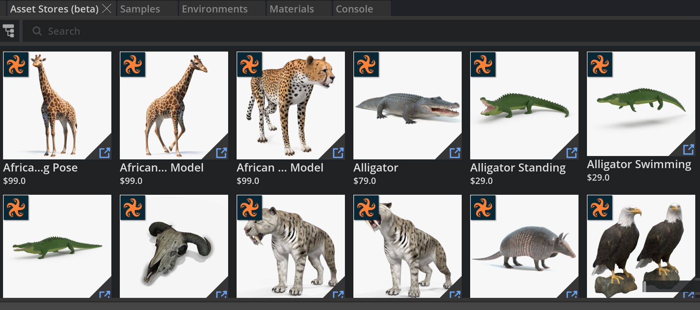

# Asset Provider Search Example



### About
This extension is a template for connecting a search API for assets to Omniverse's *Asset Browser*.

### [README](exts/omni.example.asset_provider/)
See the [README for this extension](exts/omni.example.ui_gradient_window/) to learn more about it including how to use it.

## Adding one of those Extension

To add a those extensions to your Omniverse app:
1. Go into: Extension Manager -> Gear Icon -> Extension Search Path
2. Add this as a search path: `git://github.com/NVIDIA-Omniverse/kit-extension-sample-asset-search?branch=main&dir=exts`

## Linking with an Omniverse app

For a better developer experience, it is recommended to create a folder link named `app` to the *Omniverse Kit* app installed from *Omniverse Launcher*. A convenience script to use is included.

Run:

```bash
> link_app.bat
```

There is also an analogous `link_app.sh` for Linux. If successful you should see `app` folder link in the root of this repo.

If multiple Omniverse apps is installed script will select recommended one. Or you can explicitly pass an app:

```bash
> link_app.bat --app code
```

You can also just pass a path to create link to:

```bash
> link_app.bat --path "C:/Users/bob/AppData/Local/ov/pkg/create-2022.1.3"
```


## Contributing
The source code for this repository is provided as-is and we are not accepting outside contributions.
