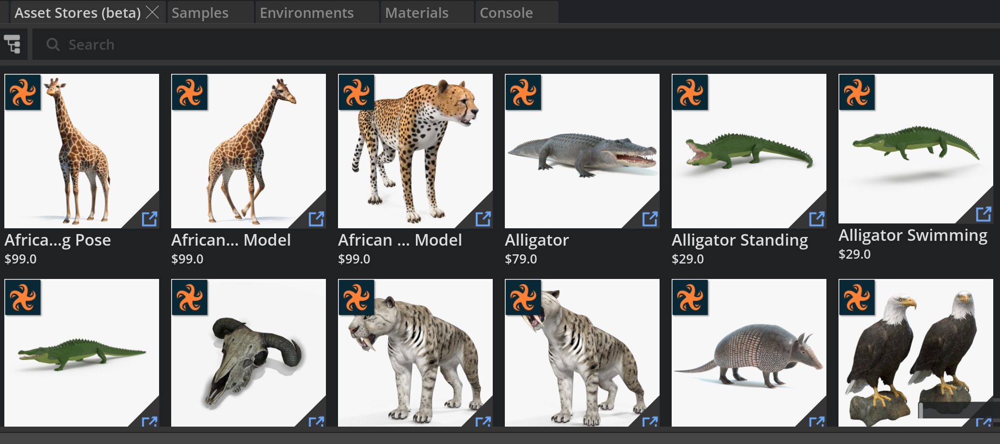
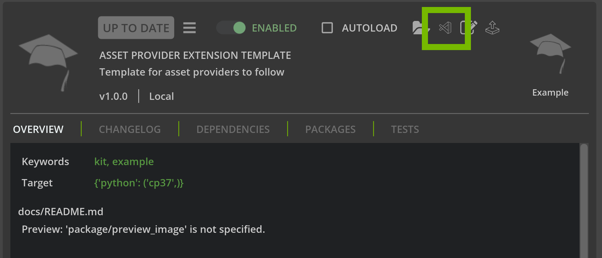

# Asset Provider Sample

This is a sample going through how to add asset content to Omniverse's Asset Store.



# Table of Contents
- Step 1: Add Base Extension
    - Step 1.1: Add Extension Through Github
    - Step 1.2: Open in Visual Studio Code
- Step 2: Inputting Provider Information
    - Step 2.1: Update Basic Information
    - Step 2.2: Update Search criteria
    - Step 2.3: Update AssetModel Creation
    - Step 2.4: Uncomment and test

## Step 1: Add Base Extension

To start we need to put the base extension inside of Omniverse. 

### Step 1.1: Add Extension Through Github

To add the extension to your Omniverse app:

 1. Go into: Extension Manager -> Gear Icon -> Extension Search Path
 2. Add this as a search path: git://github.com/NVIDIA-Omniverse/kit-extension-sample-asset-search?branch=main&dir=exts

### Step 1.2 Open in Visual Studio Code

1. Search for the extension in the Extension Tab `Asset Provider Extension Template`
2. Click on the Visual Studio Icon to open it in Visual Studio Code



3. Open `model.py`.


Here is what is inside of `model.py`

``` python
# Copyright (c) 2022, NVIDIA CORPORATION.  All rights reserved.
#
# NVIDIA CORPORATION and its licensors retain all intellectual property
# and proprietary rights in and to this software, related documentation
# and any modifications thereto.  Any use, reproduction, disclosure or
# distribution of this software and related documentation without an express
# license agreement from NVIDIA CORPORATION is strictly prohibited.

from typing import Dict, List, Optional, Union, Tuple

import aiohttp

from omni.services.browser.asset import BaseAssetStore, AssetModel, SearchCriteria, ProviderModel
from .constants import SETTING_STORE_ENABLE
from pathlib import Path

CURRENT_PATH = Path(__file__).parent
DATA_PATH = CURRENT_PATH.parent.parent.parent.parent.joinpath("data")

# The name of your company
PROVIDER_ID = "PROVIDER_NAME"
# The URL location of your API
STORE_URL = "https://www.your_store_url.com" 


class TemplateAssetProvider(BaseAssetStore):
    """ 
        Asset provider implementation.
    """

    def __init__(self, ov_app="Kit", ov_version="na") -> None:
        super().__init__(PROVIDER_ID)
        self._ov_app = ov_app
        self._ov_version = ov_version

    async def _search(self, search_criteria: SearchCriteria) -> Tuple[List[AssetModel], bool]:
        """ Searches the asset store.

            This function needs to be implemented as part of an implementation of the BaseAssetStore.
            This function is called by the public `search` function that will wrap this function in a timeout.
        """
        params = {}

        # Setting for filter search criteria
        if search_criteria.filter.categories:
            # No category search, also use keywords instead
            categories = search_criteria.filter.categories
            for category in categories:
                if category.startswith("/"):
                    category = category[1:]
                category_keywords = category.split("/")
                params["filter[categories]"] = ",".join(category_keywords).lower()

        # Setting for keywords search criteria
        if search_criteria.keywords:
            params["keywords"] = ",".join(search_criteria.keywords)


        # Setting for page number search criteria
        if search_criteria.page.number:
            params["page"] = search_criteria.page.number

        items = []


        # TODO: Uncomment once valid Store URL has been provided
        # async with aiohttp.ClientSession() as session:
        #     async with session.get(f"{STORE_URL}", params=params) as resp:
        #         result = await resp.read()
        #         result = await resp.json()
        #         items = result

        assets: List[AssetModel] = []

        # Create AssetModel based off of JSON data
        for item in items:
            assets.append(
                AssetModel(
                    identifier="",
                    name="",
                    published_at="",
                    categories=[],
                    tags=[],
                    vendor=PROVIDER_ID,
                    product_url="",
                    download_url="",
                    price=0.0,
                    thumbnail="",
                )
            )

        return (assets, False)

    def provider(self) -> ProviderModel:
        """Return provider info"""
        return ProviderModel(
            name=PROVIDER_ID, icon=f"{DATA_PATH}/logo_placeholder.png", enable_setting=SETTING_STORE_ENABLE
        )

```

## Step 2: Inputting Provider Information

### Step 2.1: Update Basic Information

1. Replace `"PROVIDER_NAME"` with your Company name related to these lines.
``` python
 # The name of your company
PROVIDER_ID = "PROVIDER_NAME" # REPLACE WITH YOUR NAME
```
2. Replace `"https://www.your_store_url.com"` with your Company's URL containing the API call. 
``` python
# The URL location of your API
STORE_URL = "https://www.your_store_url.com" # REPLACE WITH YOUR URL
```
3. If you have a logo place it in the `data` folder located in the root of `exts`.
4. At the end of `model.py` update the  `icon` parameter inside the `provider` function.
``` python
    def provider(self) -> ProviderModel:
        """Return provider info"""
        return ProviderModel( # REPLACE logo_placeholder.png WITH YOUR IMAGE
            name=PROVIDER_ID, icon=f"{DATA_PATH}/logo_placeholder.png", enable_setting=SETTING_STORE_ENABLE
        )
```
### Step 2.2: Update Search criteria

This is dependent on your API. The BaseAssetStore has search criteria's you can assign depending on your site's search API works.

Search criteria that is apart of `BaseAssetModel` include:

``` python    
            "example": {
                "keywords": ["GPU", "RTX"],
                "page": {"number": 5, "size": 75},
                "sort": ["price", "desc"],
                "filter": {"categories": ["hardware", "electronics"]},
                "vendors": ["Vendor1", "Vendor2"],
                "search_timeout": 60,
            }
```

For example if your search api uses `key` as a parameter for `keywords` then update the following lines from:

``` python
        if search_criteria.keywords:
            params["keywords"] = ",".join(search_criteria.keywords)
```

To:

``` python
        if search_criteria.keywords:
            params["key"] = ",".join(search_criteria.keywords)
```

1. Update and add each parameter based on your API.


### Step 2.3: Update AssetModel Creation

After getting the data in JSON format from your API we must turn them into an AssetModel List. If your API already does this then you can use that value inside the return statement.

The code we will update:

``` python
        # Create AssetModel based off of JSON data
        for item in items:
            assets.append(
                AssetModel(
                    identifier="",
                    name="",
                    published_at="",
                    categories=[],
                    tags=[],
                    vendor=PROVIDER_ID,
                    product_url="",
                    download_url="",
                    price=0.0,
                    thumbnail="",
                )
            )
```
Take for example this JSON object:


``` python
{

    "identifier":"1382049",
    "categories":[
    "category_1",
    "category_2",
    "category_3"
    ],
    "download_url":"None",
    "name":"Asset Name",
    "price":"29.00",
    "url":"https://www.turbosquid.com/3d-models/100-dollar-bills-stack-1382049?utm_source=omniverse",
    "pub_at":"2015-12-07T21:19:08+00:00",
    "tags":[
    "3d",
    "tag_1",
    "tag_2"
    ],
    "thumbnail":"https://url_to_thumbnail.jpg",
    "vendor":"Vendor Name"
}
```

Then the corresponding AssetModel creation will look like the following:
``` python
        # Create AssetModel based off of JSON data
        for item in items:
            assets.append(
                AssetModel(
                    identifier=item.get("identifier", "")
                    name=item.get("name", ""),
                    published_at=item.get("pub_at", ""),
                    categories=item.get("categories", []),
                    tags=item.get("tags", []),
                    vendor=PROVIDER_ID,
                    product_url=item.get("url", ""),
                    download_url=item.get("download_url", None),
                    price=item.get("price", 0),
                    thumbnail=item.get("thumbnail", ""),
                )
            )
```

### Step 2.4 Uncomment and test

1. Uncomment the following code block in `model.py`

``` python
        # TODO: Uncomment once valid Store URL has been provided
        # async with aiohttp.ClientSession() as session:
        #     async with session.get(f"{STORE_URL}", params=params) as resp:
        #         result = await resp.read()
        #         result = await resp.json()
        #         items = result
```

2. Save `model.py` and go to Omniverse and check the `Asset Store`. You should now be able to see your content.
